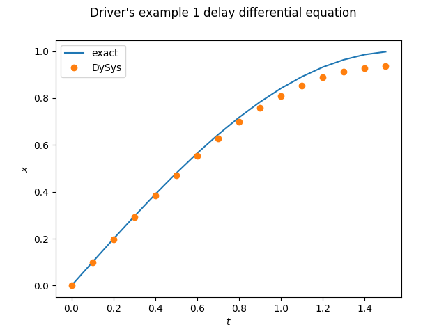

Driver ([1978](references.rst), p. 215) discusses a simple example of
numerical solution of a differential–difference equation:
```math
\dot x (t) = -x (t - \pi / 2)
```
and claims that it has the general solution
```math
x (t) = c_1 \cos t + c_2 \sin t
```
for arbitrary constants $`c_1`$ and $`c_2`$.

If the *initial function* is
```math
x (t) = \theta (t) = \sin t, \qquad \left(\frac{-\pi}{2} < t < 0\right),
```
the solution for *x* > 0 is *x* (*t*) = sin *t*.

Here this is approximated by a backward Euler method.




*Figure:—* Reproducing Example 1 from Driver (1978, p. 215)
