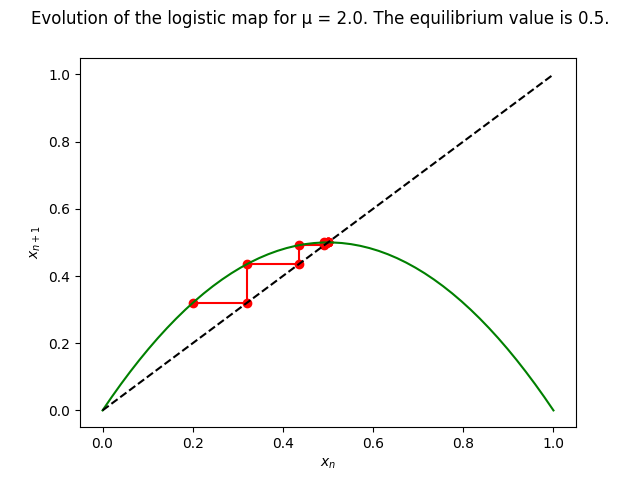

# Modelling discrete dynamical systems with TrivialSys

Discrete dynamical variables have been included in DySys for a long
time as part of hybrid continuous–discrete systems.  TrivialSys was
added for purely discrete systems.  

A classical example is the [logistic
map](https://en.wikipedia.org/wiki/Logistic_map) on the unit segment
(May 1976, eq. 3; G. L. Baker & Gollub 1990, p. 77), x <- mu * x *
(1 - x).

*Figure:—* The logistic map as an example of a discrete dynamical
system modelled with a TrivialSys
