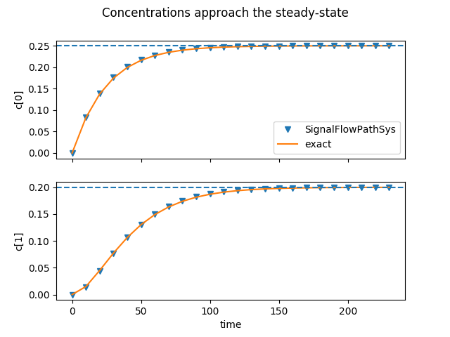

Fulford, Forrester, & Jones ([1997](references.rst), §18.2) give a simple example of two coupled linear systems: 

```math
\frac{\mathrm d}{\mathrm dt}\begin{Bmatrix}c_0 \\ c_1\end{Bmatrix}
+ \frac{1}{100}\begin{bmatrix} 4 & 3 \\ -4 & 5\end{bmatrix}\begin{Bmatrix}c_0 \\ c_1\end{Bmatrix}
= \frac{1}{100}\begin{bmatrix}1 \\ 0\end{bmatrix}\,.
```
Let's convert it to a pair of systems of which one is autonomous but the other depends on it by setting the strictly upper triangular part of the damping matrix to zero.

```math
\frac{\mathrm d}{\mathrm dt}\begin{Bmatrix}c_0 \\ c_1\end{Bmatrix}
+ \frac{1}{100}\begin{bmatrix} 4 & 0 \\ -4 & 5\end{bmatrix}\begin{Bmatrix}c_0 \\ c_1\end{Bmatrix}
= \frac{1}{100}\begin{bmatrix}1 \\ 0\end{bmatrix}\,.
```

The first system is then uncoupled.

```math
\frac{\mathrm dc_0}{\mathrm dt} + \frac{c_0}{25} = \frac{1}{100}
```
with the exact solution
```math
c_0 (t) = \left(1 - \mathrm e^{-t/25}\right)/4\,.
```
The second system depends on the first according to
```math
\frac{\mathrm dc_1}{\mathrm dt} + \frac{c_1}{20} = \frac{c_0 (t)}{25}\,,
```
which in turn has the solution
```math
c_1 (t) = 
\left(
  1 - \mathrm e^{-t/25}\right) - \frac{4}{5}\left(1 - \mathrm e^{-t/20}
\right).
```



*Figure:—* A SignalFlowPathSys consisting of one ScalarLinearDySys
driving another
